# PB Dashboard — User Guide

> Complete guide to using all features of the PB Dashboard
> Last updated: v2.4.0 — February 17, 2026

---

## Table of Contents

1. [Getting Started](#getting-started)
2. [Home — Bookmarks](#home--bookmarks)
3. [Projects](#projects)
4. [Tasks](#tasks)
5. [Calendar](#calendar)
6. [News](#news)
7. [Settings](#settings)
8. [Keyboard Shortcuts](#keyboard-shortcuts)
9. [Data Management](#data-management)

---

## Getting Started

### Installation
1. Download the latest `pb-dashboard.zip` from [Releases](https://github.com/Nexroth/pb-dashboard/releases)
2. Extract the ZIP file to a folder on your computer
3. Open `index.html` in any browser
4. Bookmark the page for easy access

### First Launch
On first launch, the dashboard creates default data in your browser's localStorage. This includes:
- Sample RSS feeds (Hacker News, Ars Technica, Wired)
- Sample Reddit subreddits (technology, programming)
- Dark theme (default)
- One empty project called "My Project"

Everything is stored locally in your browser — no accounts, no cloud, no tracking.

---

## Home — Bookmarks

The Home page is your bookmark manager organized into sections.

### Stats Overview Panel

At the top of the page, a collapsible panel shows dashboard statistics:
- Total bookmarks
- Active projects  
- Pending tasks
- Task completion rate
- Overdue projects (highlighted red when > 0)
- Overdue tasks (highlighted red when > 0)

**To collapse/expand:** Click the header or the chevron icon.

**To hide completely:** Settings → Show Stats Overview → toggle off.

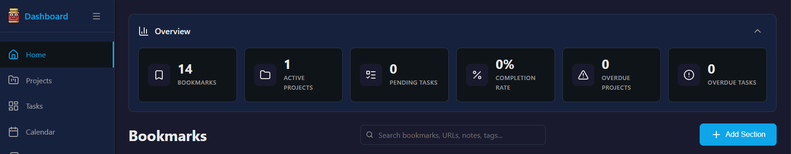
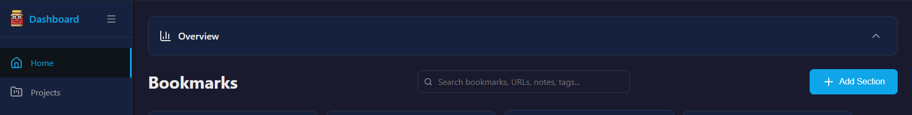

### Creating Sections

Sections organize your bookmarks into categories (Work, Personal, Research, etc.).

**To add a section:**
1. Click **Add Section** button in the top right
2. Enter a section name
3. Click **Save**

**To edit a section name:**
1. Click the pencil icon on the section header
2. Change the name
3. Click **Save**

**To delete a section:**
1. Click the trash icon on the section header
2. Confirm deletion (this deletes all bookmarks in that section)

**To reorder sections:**
- Drag section headers up/down to reorder

### Managing Bookmarks

**To add a bookmark:**
1. Click the `+` button on any section header, OR
2. Press `Alt+B` from anywhere, OR
3. Copy a URL to clipboard and press `Ctrl+V` (auto-opens the modal with URL pre-filled)
4. Fill in:
   - **Name** (required) — display name
   - **URL** (required) — full URL starting with https://
   - **Icon** (optional) — upload a square image (90x90px recommended)
   - **Notes** (optional) — private notes about this bookmark
   - **Tags** (optional) — comma-separated (e.g., "work, urgent, reference")
5. Click **Save**

**To edit a bookmark:**
- Right-click the bookmark card → **Edit**

**To delete a bookmark:**
- Right-click the bookmark card → **Delete**

**To copy a bookmark URL:**
- Right-click the bookmark card → **Copy URL**

**To view bookmark notes:**
- Right-click the bookmark card → **View Notes**

**To reorder bookmarks:**
- Drag bookmark cards within a section or between sections

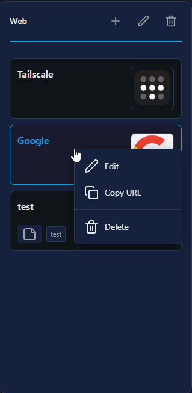
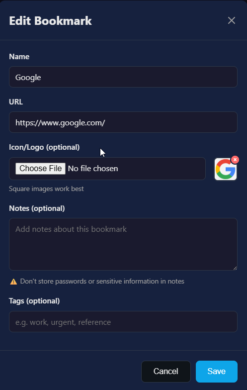

### Searching Bookmarks

The search bar at the top filters across:
- Bookmark names
- URLs
- Notes
- Tags

Results update as you type. Search is case-insensitive.

**To clear search:** Click the X button in the search bar or press `Esc` while focused in the search box.

**Keyboard shortcut:** Press `/` to focus the search bar from anywhere on the Home page.

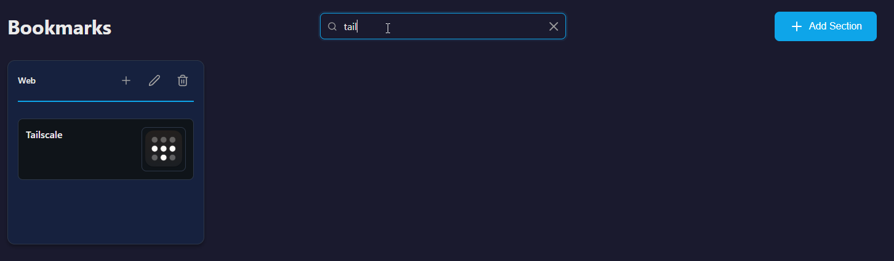

---

## Projects

The Projects page shows all your projects as a kanban board or table view.

### Project Columns

Default columns:
- **Planning** — project is being scoped
- **Active** — work in progress
- **On Hold** — paused/waiting
- **Completed** — finished
- **Archived** — no longer active but kept for reference

**To change a project's status:**
- Drag the project card to a different column

**Note:** Projects with unfinished tasks cannot be moved to Completed — finish or delete all tasks first.

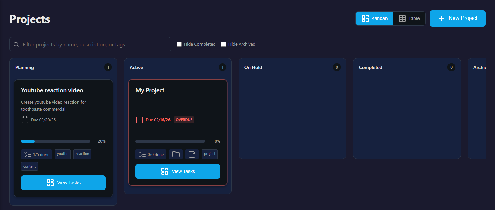

### Creating Projects

**To create a new project:**
1. Click **New Project** button
2. Fill in:
   - **Create from template** (optional) — select a project template to auto-fill fields and create linked tasks
   - **Project Name** (required)
   - **Description** (optional) — short summary
   - **Notes** (optional) — longer-form notes
   - **Due Date** (optional)
   - **Status** — defaults to Planning
   - **Tags** (optional) — comma-separated
   - **Folder Reference** (optional) — local folder path (e.g., `C:\Projects\MyProject`)
3. Click **Save**

If a template is selected, a summary line shows "Will create X task(s) from template" before saving.

**Keyboard shortcut:** `Alt+P` opens the new project modal from any page.

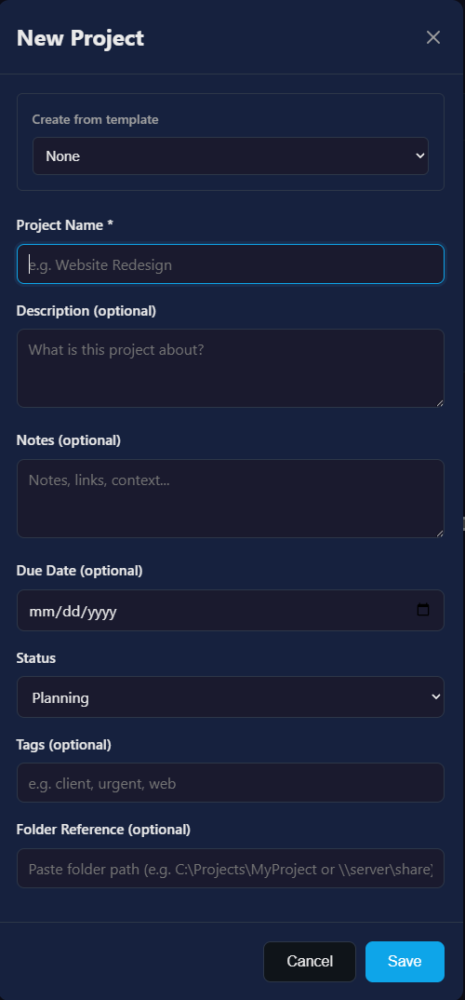

### Editing Projects

**To edit a project:**
- Right-click the project card → **Edit Project**

**To view project description/notes:**
- Right-click the project card → **View Notes**

**To go to a project's tasks:**
- Right-click the project card → **View Tasks**, OR
- Click **View Tasks** button on the card

**To open a project's folder:**
- Right-click the project card → **Open Folder** (copies path to clipboard — paste in File Explorer)

**To export a project:**
- Right-click the project card → **Export Project**
- Choose HTML or Markdown format
- File downloads with project name and date

**To delete a project:**
- Right-click the project card → **Delete** (also deletes all tasks in the project)

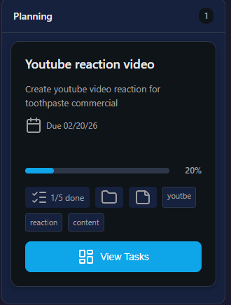
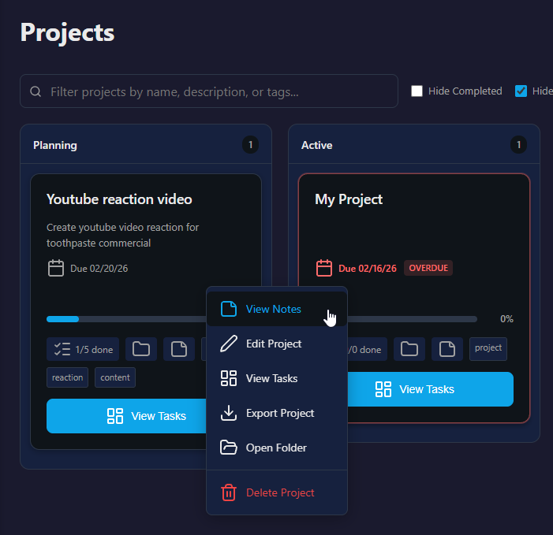

### Filtering Projects

**Hide Completed:** Checkbox at the top removes Completed projects from the kanban view.

**Hide Archived:** Checkbox at the top removes Archived projects from the kanban view.

**Search:** Search bar filters by project name, description, and tags. When searching, hidden columns reappear if they contain matching projects. Archived projects show an ARCHIVED badge when found in search.

### Table View

Switch to table view using the toggle button in the top right. Shows all projects in a sortable table.

**To sort:** Click any column header. Click again to reverse sort order.

**Columns:**
- Project (name + description + tags)
- Status
- Due Date
- Progress (task completion %)
- Tasks (done/total)
- Folder (button to open if set)
- Actions (edit/delete)

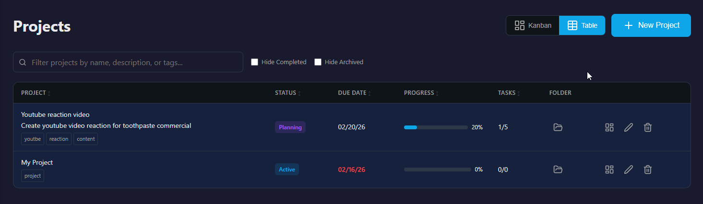

---

## Tasks

The Tasks page is a per-project task board. Select a project from the dropdown at the top to view its tasks.

**Note:** Archived projects don't appear in the project dropdown.

### Kanban vs Table View

Switch views using the toggle button in the top right:
- **Kanban** — visual board with task cards in columns
- **Table** — sortable table with all task details

### Creating Tasks

**To create a task:**
1. Click **Add Task** button or press `Alt+T`
2. Fill in:
   - **Create from template** (optional) — select a task template to auto-fill fields
   - **Title** (required)
   - **Status** — defaults to second column (e.g., "In Progress")
   - **Priority** — Low, Medium, High, Critical
   - **Due Date** (optional)
   - **Tags** (optional) — comma-separated
   - **Notes** (optional)
   - **Folder Reference** (optional) — local folder path
   - **Todo List** (optional) — add checklist items
3. Click **Save**

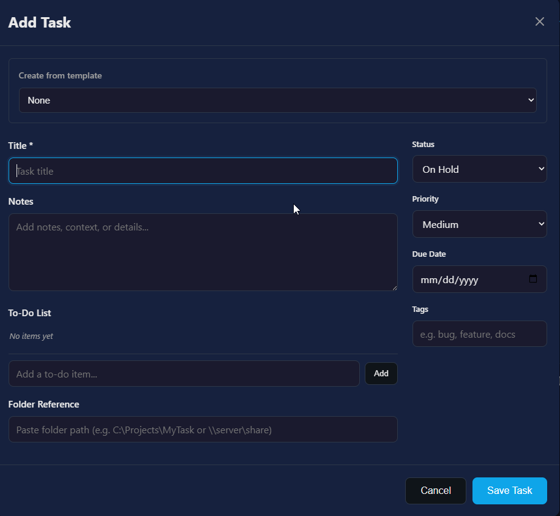

### Managing Tasks

**To edit a task:**
- Right-click the task card → **Edit Task**

**To view task notes and todos:**
- Right-click the task card → **View Notes & Todos**

**To open a task's folder:**
- Right-click the task card → **Open Folder** (copies path to clipboard)

**To delete a task:**
- Right-click the task card → **Delete**

**To reorder tasks within a column:**
- Drag task cards up/down

**To move tasks between columns:**
- Drag task cards left/right to different status columns

### Todo Checklists

Each task can have a todo checklist. Todos are mini-items within a task.

**To add a todo item:**
1. Open the task edit modal
2. Type in the "Add a todo item..." input
3. Press Enter or click **Add**

**To check/uncheck a todo:**
- Click the checkbox next to the item

**To edit a todo:**
- Click directly in the text field and edit

**To delete a todo:**
- Click the X button on the right side of the item

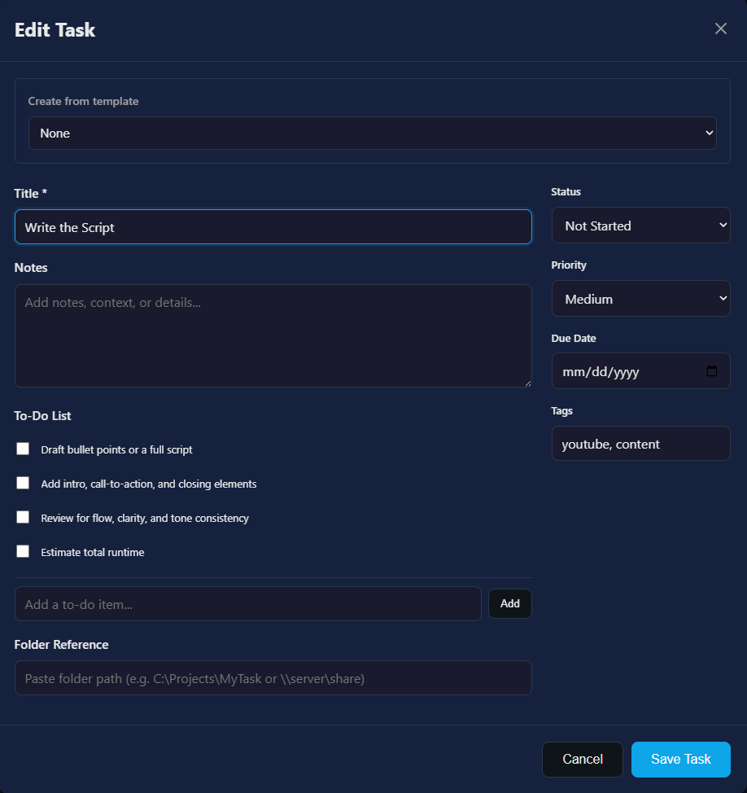

### Filtering and Searching Tasks

**Hide Done:** Checkbox at the top hides completed tasks from the kanban view.

**Search:** Search bar filters by task title, notes, tags, and todo text. Results update as you type.

**Keyboard shortcut:** Press `/` to focus the search bar.

### Table View

Shows all tasks in a sortable table with columns:
- Task (title + notes + tags + todos progress)
- Status
- Priority
- Due Date
- Progress (todos completed)
- Folder
- Actions

**To sort:** Click column headers.

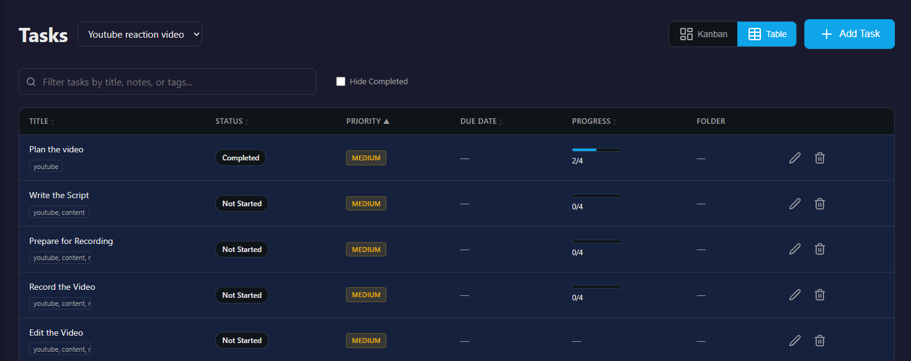

---

## Calendar

The Calendar page shows a monthly view with all projects and tasks that have due dates.

### Navigation

- **Prev/Next arrows** — change months
- **Today button** — jump to current month
- **Month/Year title** — shows current month displayed

### Visual Indicators

**Color coding:**
- Purple dots — projects
- Blue dots — tasks
- Red dots — overdue items

**Holiday display:** US holidays appear beneath each date number in small text.

### Interacting with Calendar

**To view events for a specific day:**
- Click the day — right sidebar opens showing all events for that date

**To navigate to a project or task:**
- Click an event in the sidebar — navigates to that item

**To view event notes:**
- Right-click an event in the sidebar → shows notes in a popup

**To create a project or task with a pre-filled due date:**
- Right-click any day → **Create Project Due This Day** or **Create Task Due This Day**

**To close the sidebar:**
- Click the X button or press `Esc`

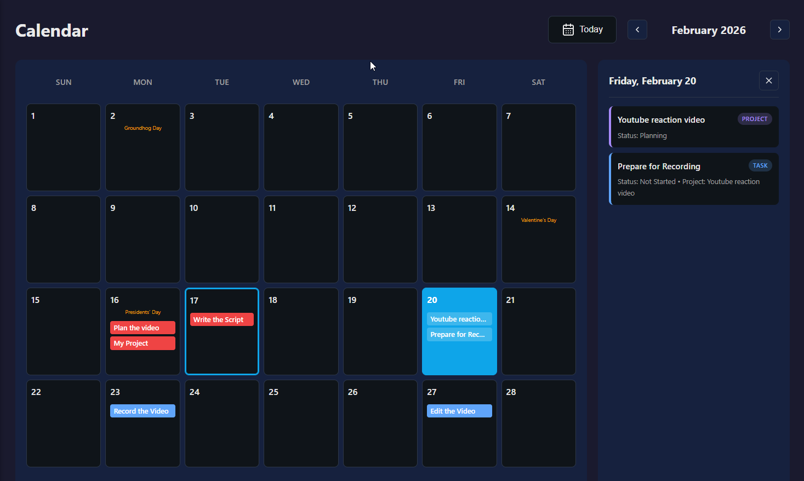
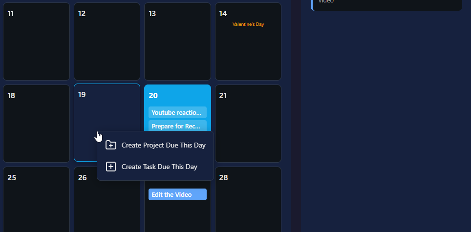

---

## News

The News page has two sections: RSS Feeds and Reddit.

### RSS Feeds

**Morning Coffee tab:** Shows the 3 most recent articles across all your feeds combined. Loads automatically when you open the News page.

**Individual feed tabs:** Each RSS feed gets its own tab showing up to 10 articles.

**To add a feed:**
1. Click the **⚙ Manage** button
2. Paste the RSS feed URL
3. Click **Add Feed**

**To rename a feed:**
1. Click **⚙ Manage**
2. Click the feed name field
3. Type a new name
4. Press Enter or click away to save

**To delete a feed:**
1. Click **⚙ Manage**
2. Click the **Delete** button next to the feed

**Finding RSS feeds:** Most news sites have an RSS feed. Try:
- Look for an RSS icon in the site header/footer
- Append `/rss` or `/feed` to the site URL
- Search "[site name] RSS feed"

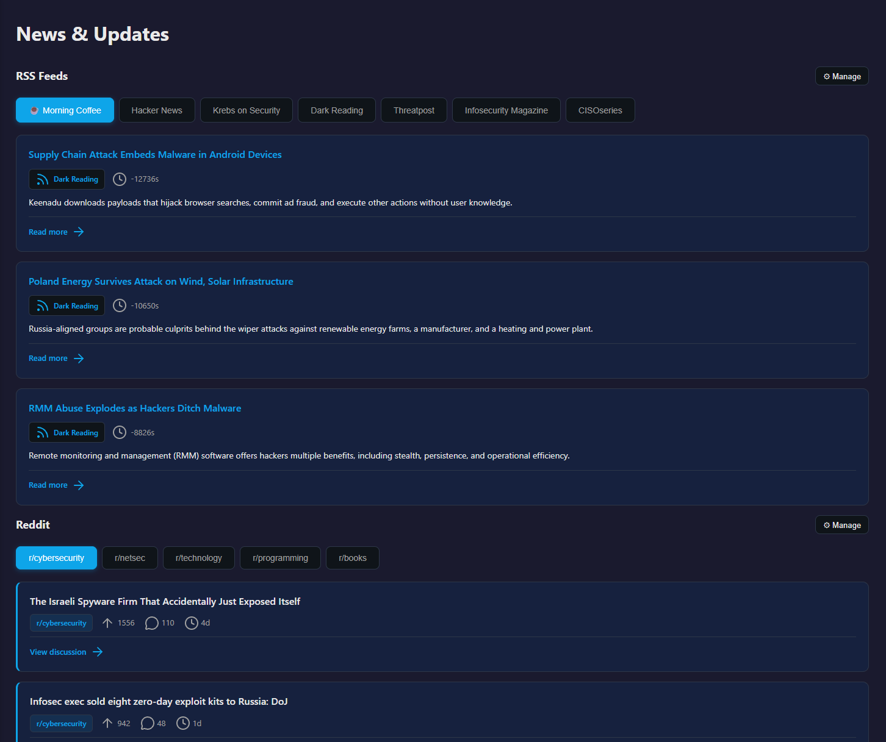
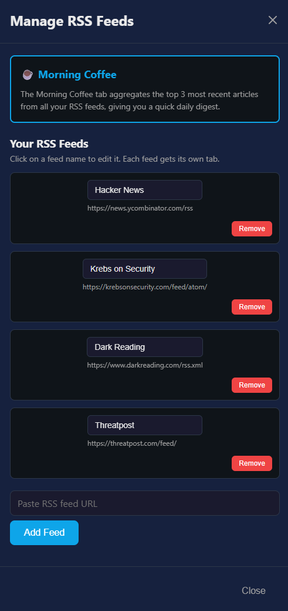

### Reddit

Shows the top posts from the past week for each subreddit you add.

**To add a subreddit:**
1. Click **⚙ Manage**
2. Enter subreddit name without `r/` (e.g., just `technology`)
3. Click **Add Subreddit**

**To remove a subreddit:**
1. Click **⚙ Manage**
2. Click **Remove** next to the subreddit

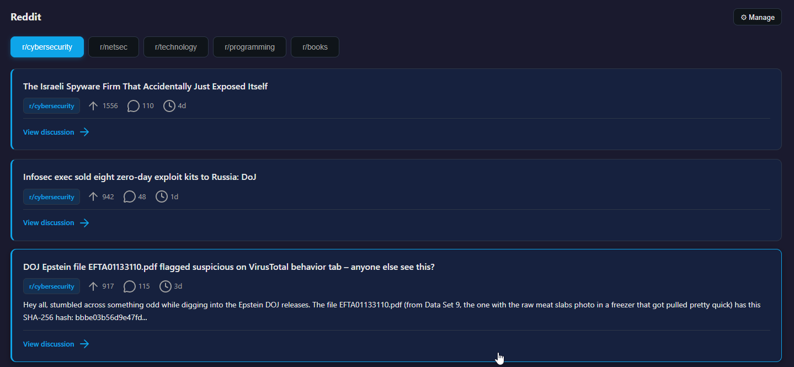

---

## Settings

### Themes

**To change theme:**
1. Go to Settings → Theme
2. Select from 8 presets:
   - Light
   - Dark
   - Nordic
   - Catppuccin
   - Dracula
   - Solarized
   - Cyberpunk
   - Peanut Butter (custom yellow/brown theme)

**To create a custom theme:**
1. Select **Custom** from the theme dropdown
2. Use the 5 color pickers to set:
   - Background (main page color)
   - Section/Sidebar (cards and sidebar background)
   - Bookmark Cards (individual card background)
   - Text (all text)
   - Accent (buttons, badges, active states)
3. Theme saves automatically

**Tips for custom themes:**
- Keep high contrast between text and background
- Test the accent color on both dark and light backgrounds
- Hover states are derived automatically from your colors

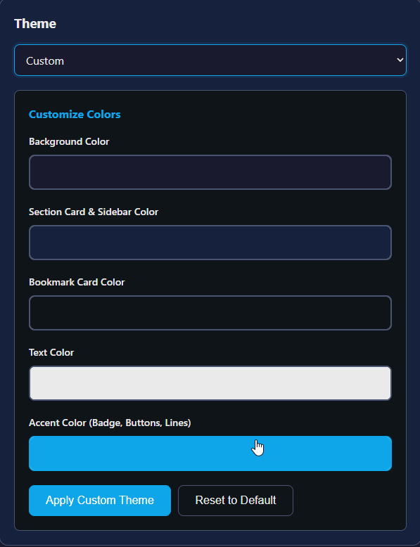

### Templates

Templates allow you to create reusable blueprints for projects and tasks.

**To access templates:**
Settings → **Manage Templates** button

#### Project Templates

**To create a project template:**
1. Click **Add Project Template**
2. Fill in:
   - **Template Name** (required) — e.g., "Security Camera Installation"
   - **Description** (optional) — what this template is for
   - **Tags** (optional) — default tags to add to projects
   - **Linked Task Templates** (optional) — check which task templates should be created when using this template. **Functionally, you want to create tasks templates before a project template if you want to add them to the project.**
1. Click **Save Template**

**To edit a project template:**
- Click **Edit** on the template card

**To duplicate a project template:**
- Click **Duplicate** — creates a copy with "(Copy)" appended to the name

**To delete a project template:**
- Click **Delete**

**To use a project template:**
1. Go to Projects page → **New Project**
2. Select the template from the "Create from template" dropdown
3. Template fills in the project name, description, and tags
4. If linked tasks are configured, a summary shows "Will create X task(s) from template"
5. Edit any pre-filled fields if needed
6. Click **Save** — project and linked tasks are created

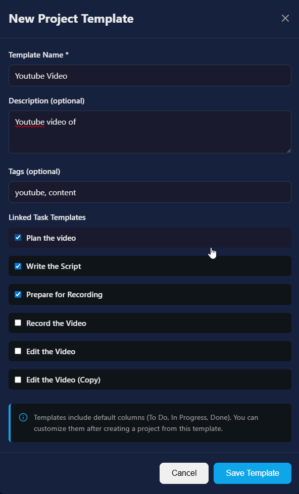
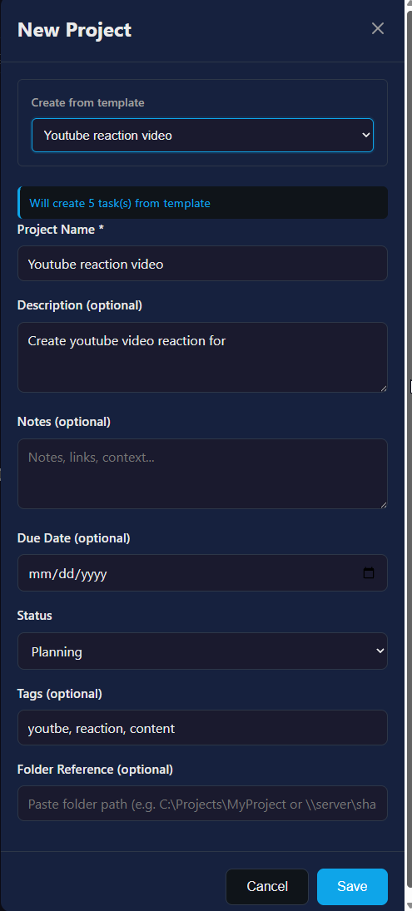

#### Task Templates

**To create a task template:**
1. Click **Add Task Template**
2. Fill in:
   - **Template Name** (required) — e.g., "Bug Fix Template"
   - **Description** (optional)
   - **Default Task Title** — pre-filled title when using this template
   - **Default Notes** — pre-filled notes
   - **Tags** (optional)
   - **Todo Items** (optional) — add checklist items that will be copied to tasks
3. Click **Save Template**

**To add todos to a task template:**
1. In the Todo Items section, type an item in the input
2. Press Enter or click **Add**
3. Repeat for each item
4. Edit or delete items using the controls on each row

**To edit a task template:**
- Click **Edit** on the template card

**To duplicate a task template:**
- Click **Duplicate**

**To delete a task template:**
- Click **Delete**

**To use a task template:**
1. Open the Add Task modal (from Tasks page or calendar right-click)
2. Select the template from the "Create from template" dropdown
3. Template fills in title, notes, tags, and todos (all unchecked)
4. Edit any pre-filled fields if needed
5. Click **Save**

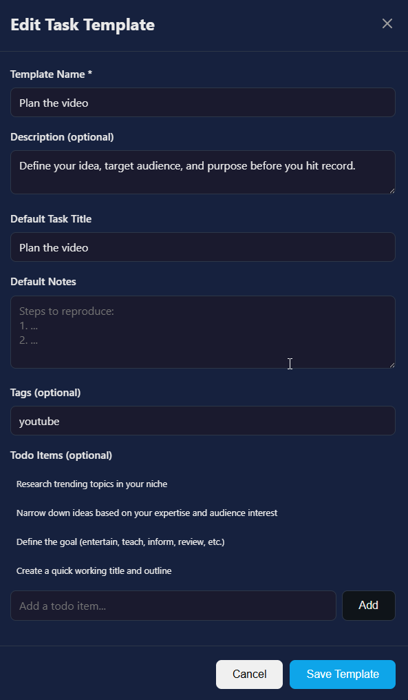

### Notifications

Optional in-app notification system (no browser permissions required).

**To enable notifications:**
Settings → Notifications → Toggle **Enable Notifications** ON

**To configure notifications:**
- **Daily digest** — once per day summary (configure time below)
- **Overdue reminders** — when you have overdue projects or tasks
- **3-day deadline warnings** — alerts 3 days before due dates
- **1-day deadline warnings** — alerts 1 day before due dates

**Time settings:**
- **Daily Digest Time** — when to show the daily summary (default: 9:00 AM)
- **Quiet Hours** — suppress notifications during specific hours (default: 10:00 PM - 7:00 AM)

**To test notifications:**
Click **Send Test Notification** to see how they appear.

Notifications appear in the bottom-right corner and auto-dismiss after a few seconds.

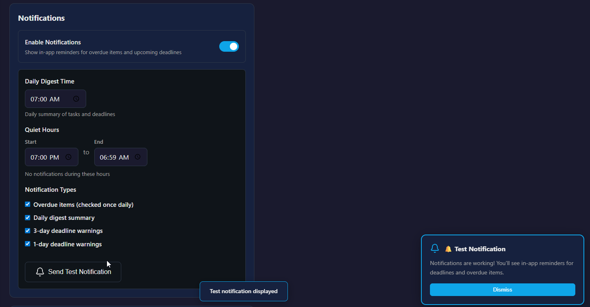

### Stats Overview

**To show/hide the stats panel on the Home page:**
Settings → **Show Stats Overview** toggle

When enabled, the stats panel appears at the top of the Home page. Panel remembers its collapsed/expanded state.

### Updates

**To check for updates:**
Settings → Updates → **Check for Updates** button

If a newer version is available, instructions will appear with a link to download the latest release.

**Current version:** Displayed just above the button.

---

## Keyboard Shortcuts

Press `?` or `Shift+/` to open the keyboard shortcuts panel.

### Navigation
| Shortcut | Action |
|---|---|
| `/` | Focus search on current page |
| `Esc` | Close open modal or panel |
| `?` | Show keyboard shortcuts help |

### Quick Actions
| Shortcut | Action |
|---|---|
| `Alt+B` | Add bookmark (any page) |
| `Alt+P` | Add project (any page) |
| `Alt+T` | Add task (Tasks page only) |
| `Ctrl+V` | Paste URL as new bookmark (if URL on clipboard) |

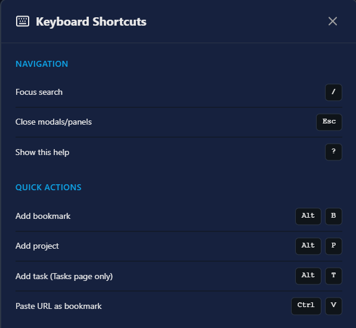

---

## Data Management

All data is stored in your browser's localStorage. This includes bookmarks, projects, tasks, theme settings, RSS feeds, and Reddit subscriptions.

### Export Data

**To export your data:**
1. Settings → **Export Data** button
2. A JSON file downloads with the filename `dashboard-backup-YYYY-MM-DD.json`
3. Store this file safely — it's your full backup

**What's included:**
- All bookmarks and sections
- All projects and tasks
- Theme settings
- RSS feeds and subreddits
- Templates
- Notification settings

**Export reminders:** The dashboard will remind you to export if it's been 30+ days since your last backup. You can snooze for 7 days or export immediately.

### Import Data

**To import data:**
1. Settings → **Import Data** button
2. Select a previously exported JSON file
3. Click **Open**
4. Dashboard restores all data from the backup

**⚠️ Warning:** Import replaces all current data. Export first if you want to keep anything from the current state.

### Clear All Data

**To reset the dashboard:**
1. Settings → **Clear All Data** button
2. Confirm twice (this is permanent)
3. Dashboard resets to factory defaults
4. Page reloads automatically

**⚠️ Warning:** This permanently deletes everything. Export first!

### Multiple Devices

The dashboard has no automatic sync. To use on multiple devices:
1. Export data from Device A
2. Transfer the JSON file to Device B (email, USB drive, cloud storage)
3. Import the file on Device B

Repeat whenever you want to sync changes.

---

## Tips & Best Practices

### Organization
- Use sections to group related bookmarks (Work, Personal, Research, Clients, etc.)
- Tag bookmarks and projects consistently for better search
- Archive completed projects instead of deleting them — keeps history intact
- Use folder references on projects/tasks to quickly access related files

### Workflow
- Set due dates on projects and tasks to see them in the calendar
- Use the stats panel to track overall progress at a glance
- Create task templates for recurring work patterns (bug fixes, code reviews, deployments)
- Link task templates to project templates for instant project setup
- Check the Morning Coffee tab daily for a quick news overview

### Backup Strategy
- Export data monthly or before major changes
- Keep multiple backup files with dates in the filename
- Store backups in cloud storage or on a separate drive
- Test your backup by importing it occasionally to verify it works

### Performance
- The dashboard works fine with 100+ bookmarks and multiple projects
- Feeds only load when you click a tab — no background polling
- All data is stored locally — no network required after initial page load
- Clear old archived projects and completed tasks periodically to keep things snappy

---

## Troubleshooting

### Bookmarks aren't loading
- Hard refresh the page (`Ctrl+Shift+R` or `Cmd+Shift+R`)
- Check browser console for errors (F12 → Console tab)
- Try importing a backup if you have one

### Theme isn't saving
- Make sure localStorage is enabled in your browser
- Private/Incognito mode doesn't persist localStorage between sessions

### RSS feed not loading
- Verify the feed URL works in an RSS reader
- Some feeds block CORS — try a different feed to test
- The RSS proxy service (rss2json.com) may be down — try again later

### Modal buttons not working
- Hard refresh (`Ctrl+Shift+R`)
- Check browser console for JavaScript errors
- Update to the latest version from GitHub releases

### Data disappeared
- Check if you're in Private/Incognito mode (data doesn't persist)
- Check if another tab cleared data
- Import your most recent backup

---

**Last updated:** v2.4.0 — February 17, 2026  
**GitHub:** [Nexroth/pb-dashboard](https://github.com/Nexroth/pb-dashboard)  
**Issues & Feedback:** Use the GitHub Issues tab or the 👎 button in the dashboard
